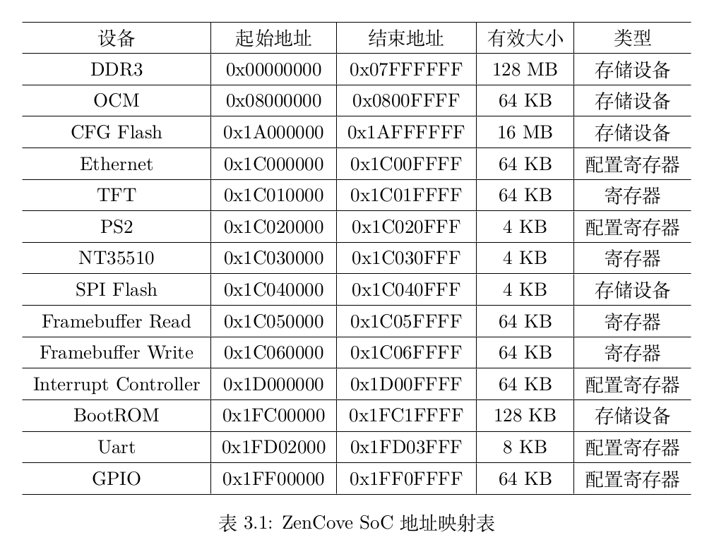
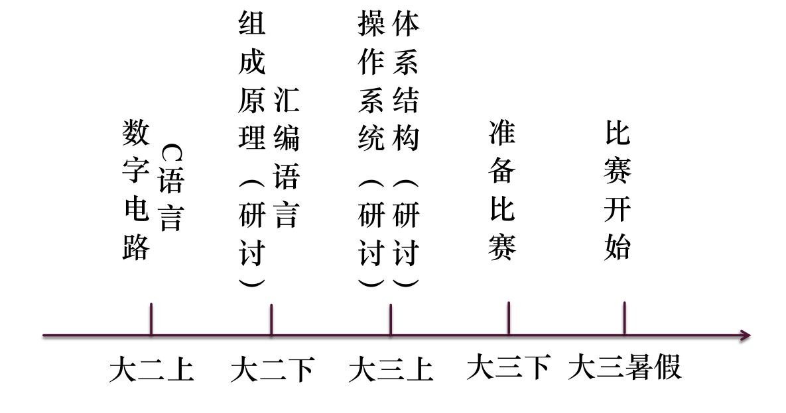

# “龙芯杯”大赛介绍
## 第一次培训

---

- 大赛简介
- 大赛赛制
- 大赛趋势
- 能力要求
- 加分情况
- 培训计划

---

## 大赛简介

----

基于指定的指令集构建**完整的计算机系统**。

----

分为*硬件系统搭建*以及*系统软件移植*两个部分：

- 硬件系统
	- CPU 微结构设计与性能调优
	- 外设控制器与片上互联结构设计
- 软件系统
	- 固件适配移植
	- 操作系统适配移植

----

最终的评判标准包括但不限于：

+ CPU 的运行性能
+ 技术自主性
+ 计算机系统的完整性与稳定性

---

## 大赛赛制

----

|名称|参赛人数|指令集|进入决赛？|
|:---:|:---:|:---:|:---:|
|个人赛|1|MIPS|-|
|团队赛|2～4|MIPS|CPU 具有较好性能|
|LoongArch 挑战赛|2～4|LoongArch|启动 Linux|

----

MIPS：延迟槽（挺烦的）

+ 取指
+ 分支预测
+ 例外处理

----

LA32r：精简

+ 没有延迟槽
+ 特权态简单
+ 没有非对齐访存指令

---

## 大赛趋势

----

+ 近年来的特等奖、一等奖几乎被**清华大学**包揽
+ 团队赛决赛门槛**越来越高**
+ LA 赛道决赛要求**启动 Linux**

----

### 特等奖

+ 微架构：乱序多发射
+ 操作系统：运行**完整 Linux**
+ SOC：支持除 USB 外全部外设

----

---

## 能力要求

----

---

## 加分情况

----

属于*学科竞赛类*奖励，与数学建模等属于**同一类**，取得分最高项加分。

|奖项|加分分数|
|:---:|:---:|
|一等奖|2分|
|二等奖|1.8分|
|三等奖|1.5分|

注：与 ACM、IGEM、机器人竞赛属于不同类，加分可累加。

---

## 培训计划

----

+ 时间：每周六上午 10:00 开始，持续 1 ～ 2 小时
+ 内容：包括但不限于
  1. linux 操作系统的使用
  2. 课程工程框架
  3. 仿真代码阅读(装在 RAM 里的)
  4. verilator 入门(包含 c++ 类与对象基础知识)
  5. FPGA 设计流程
  6. spinalHDL 入门

----

### 推荐学习资料

+ [一生一芯计划](https://ysyx.oscc.cc/)
+ [一生一芯视频合集](https://space.bilibili.com/2107852263/channel/collectiondetail?sid=690279)
+ 《超标量处理器设计》
+ 《计算机系统设计（下册）：基于 FPGA 的 SOC 设计与实现》

----

### 尽快组队
